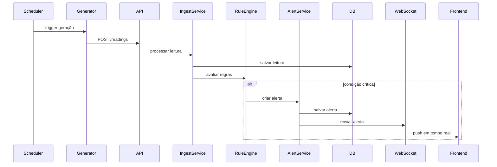
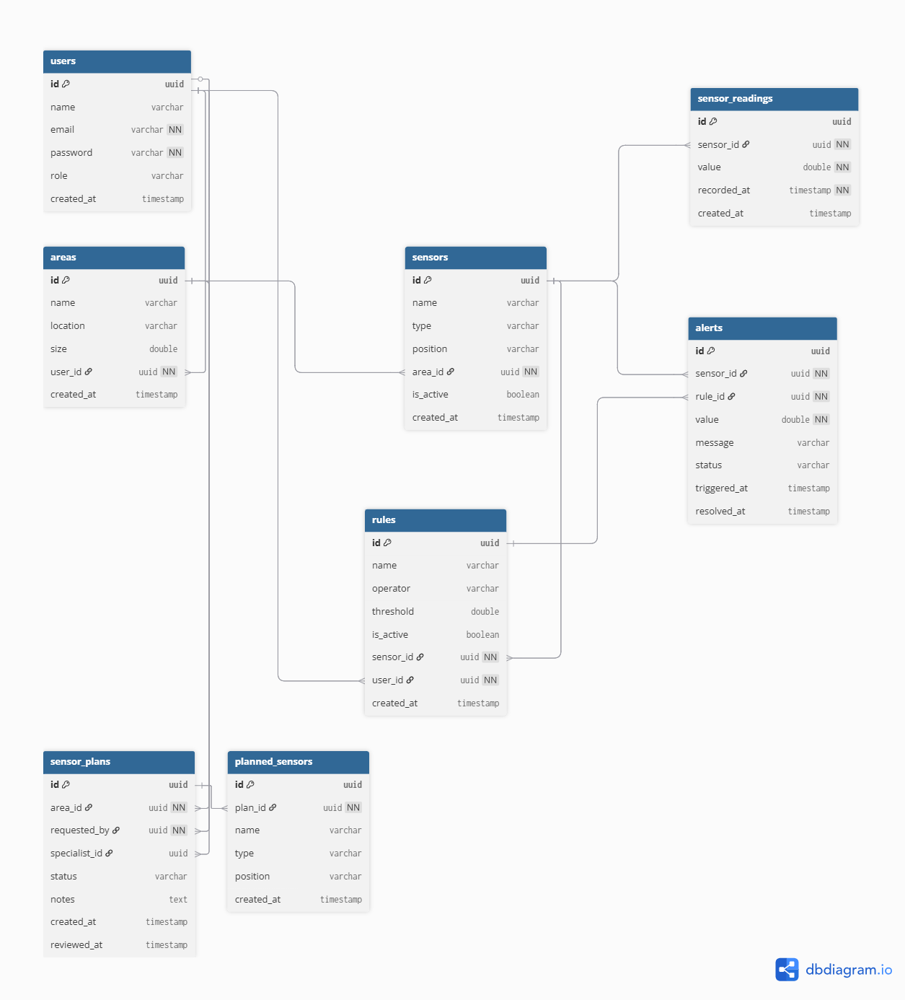

# AgroTech System — Regras de Negócio e Modelagem (Workflow de Sensores)

---

## Visão Geral

Este documento descreve as regras de negócio e decisões de modelagem relacionadas ao fluxo de planejamento, criação e operação de sensores no sistema **AgroTech System**.

O sistema foi projetado para simular um ambiente real de agricultura de precisão, incluindo um processo estruturado de solicitação, planejamento técnico, aprovação e monitoramento.

---

# Conceitos Principais

## Papéis do Sistema

### OPERADOR

* Dono das áreas agrícolas
* Responsável por solicitar sensores
* Aprova ou rejeita planos

### ESPECIALISTA

* Responsável por planejar os sensores
* Define tipo e localização dos sensores

### ADMIN (opcional)

* Pode gerenciar usuários e atribuições

---

# Fluxo Geral do Sistema

O sistema é dividido em três etapas principais:

---

## 1. Planejamento

1. O operador cria uma solicitação de sensores (`sensor_plan`)
2. O plano inicia com status `PENDING`
3. Um especialista pode ser atribuído posteriormente
4. O especialista define os sensores (`planned_sensors`)

---

## 2. Aprovação

1. O operador analisa o plano
2. Pode:
   * Aprovar (`APPROVED`)
   * Rejeitar (`REJECTED`)
3. Em caso de rejeição:
   * O status retorna para `IN_PROGRESS` quando um novo especialista volta a atuar no plano

---

## 3. Execução

1. Após aprovação:
   - Os `planned_sensors` são convertidos em `sensors`
2. Os sensores passam a gerar dados simulados
3. Leituras são armazenadas no sistema

---

## 4. Monitoramento e Decisão

1. Regras são aplicadas sobre leituras
2. Alertas são gerados automaticamente
3. O operador pode marcar alertas como resolvidos

---

# Modelagem de Entidades

---

## sensor_plans

Representa uma **solicitação de planejamento de sensores**.

### Responsabilidades:

* Registrar o pedido do operador
* Controlar o fluxo (status)
* Armazenar o especialista responsável

### Campos importantes:

* `requested_by`: operador (dono do plano)
* `specialist_id`: especialista atribuído (**opcional**)
* `status`: estado do plano

---

## planned_sensors

Representa os sensores planejados pelo especialista.

### Características:

* Pertencem a um `sensor_plan`
* Ainda não existem fisicamente no sistema
* São apenas uma definição técnica

### Campos:

* `type`: tipo do sensor
* `position`: localização lógica

---

## sensors

Sensores reais criados após aprovação do plano.

* Associados a uma área
* Começam a gerar dados simulados

---

# Estados do Plano

| Status      | Descrição                           |
| ----------- | ----------------------------------- |
| PENDING     | Plano criado, aguardando atribuição |
| IN_PROGRESS | Especialista trabalhando            |
| APPROVED    | Plano aprovado pelo operador        |
| REJECTED    | Plano rejeitado                     |

---

## Regras de estado

* `PENDING` → `IN_PROGRESS` (quando especialista é atribuído)
* `IN_PROGRESS` → `APPROVED` ou `REJECTED`
* `REJECTED` → pode voltar para `IN_PROGRESS` com novo especialista

---

# Regras de Negócio

---

## Segurança e Acesso

* Usuário só pode acessar suas próprias áreas
* Operador só pode aprovar seus próprios planos
* Especialista só pode editar planos atribuídos a ele
* Especialista pode atribuir planos a ele

---

# Simulação de Dados

* Sensores geram leituras automaticamente
* Execução via scheduler
* Intervalo configurável

---

# Regras e Alertas

* Regras são configuradas por sensor
* Leituras são avaliadas automaticamente
* Alertas são gerados quando condições são atendidas

---

# Arquitetura Geral do Sistema

O **AgroTech System** é uma plataforma completa para monitoramento inteligente em agricultura de precisão, projetada para simular e gerenciar operações agrícolas de forma eficiente. O sistema integra simulação de sensores, processamento de dados em tempo real, detecção de condições críticas e suporte à tomada de decisão, tudo em um ambiente controlado e seguro.

## Componentes Principais

- **Gestão de Usuários e Áreas**: Controle de acesso baseado em roles, permitindo que operadores gerenciem suas áreas agrícolas, especialistas planejem sensores e administradores supervisionem o sistema.
- **Workflow de Sensores**: Processo estruturado de planejamento, aprovação e execução, garantindo que sensores sejam implantados de forma organizada e alinhada às necessidades do operador.
- **Simulação e Monitoramento**: Geração automática de dados simulados, avaliação de regras de negócio e geração de alertas para condições anômalas, como temperaturas elevadas ou umidade insuficiente.
- **Interface e Dashboards**: Visualização interativa de dados, com indicadores de performance, históricos de leituras e status de alertas ativos.

## Benefícios do Sistema

- **Otimização Agrícola**: Ajuda a reduzir perdas, otimizar irrigação e prevenir pragas através de monitoramento contínuo.
- **Tomada de Decisão**: Fornece dados em tempo real para decisões rápidas, melhorando a produtividade e sustentabilidade.
- **Escalabilidade**: Suporte a múltiplas áreas e sensores, com regras dinâmicas para adaptação a diferentes cenários agrícolas.
- **Segurança**: Autenticação robusta e autorização baseada em roles, protegendo dados sensíveis.

O sistema é ideal para treinamento, prototipagem e demonstração de conceitos de IoT agrícola, oferecendo uma visão completa do ciclo de vida de dados em aplicações de precisão.

---

# Fluxo de Geração de Dados

O processo de geração de dados é automatizado e simula um ambiente real de sensores IoT. Abaixo, um diagrama de sequência ilustrando o fluxo:

Este fluxo garante que dados sejam gerados continuamente, regras sejam aplicadas em tempo real e alertas sejam emitidos automaticamente, permitindo monitoramento proativo das condições agrícolas.

---

# Esquema de Banco de Dados

O esquema completo está disponível no arquivo `docs/db.dbml`.